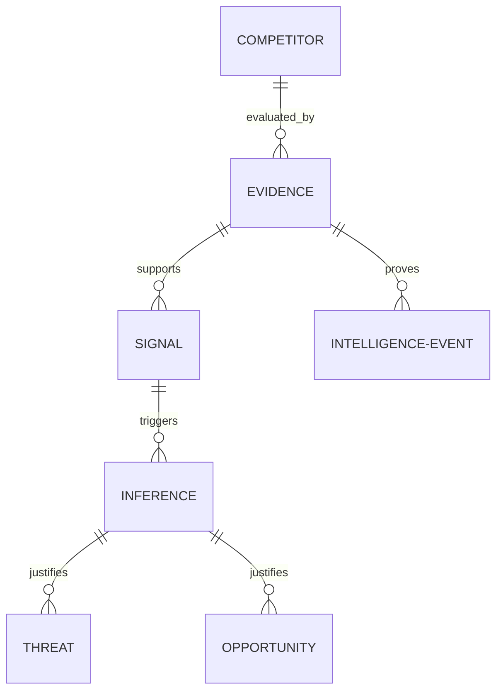

# Intelligence Contract

The Intelligence Contract guarantees traceabilty and structural consistency across the competitive intelligence lifecycle.

## Schema Relationships

Every report maps raw facts to final strategic decisions via strict foreign-key style relationships.

## Contract Rules

1. **No Orphan Claims**: An `Inference`, `Threat`, or `Opportunity` must reference at least one `Signal` or `Evidence` ID.
2. **Traceability**: All objects must be serializable to JSON according to the respective schema file under the `schemas/` directory.
3. **Trace Path**: 
   - `Threat` / `Opportunity` -> `Inference` -> `Signal` -> `Evidence` -> `Source`.
