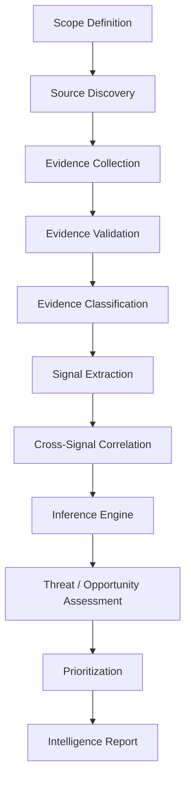

# Intelligence Pipeline

This document formalizes the operational stages of the Competitive Intelligence pipeline.

## Stage Descriptions

### 1. Scope Definition
Defines the target company, industry, geography, and known competitors to monitor. Sets constraints.

### 2. Source Discovery
Finds primary, secondary, and community sources relevant to the defined scope.

### 3. Evidence Collection
Harvests raw inputs (text, pricing pages, screenshots, articles).

### 4. Evidence Validation
Determines authenticity, authoritativeness, and freshness. Discards garbage.

### 5. Evidence Classification
Classes evidence into Levels:
- **Level 1 (Verified Fact)**
- **Level 2 (Observed Signal)**
- **Level 3 (Inference)**
- **Level 4 (Hypothesis)**

### 6. Signal Extraction
Transforms validated raw evidence into clean, structured events (pricing, feature adjustments).

### 7. Cross-Signal Correlation
Identifies patterns by linking multiple separate signals (e.g., enterprise pricing shift + enterprise hiring).

### 8. Inference Engine
Deduces strategies and shifts based on correlated signals, assigning strict confidence.

### 9. Threat / Opportunity Assessment
Determines impact, probability, and market potential of inferred states.

### 10. Prioritization
Scores threats and opportunities mathematically.

### 11. Intelligence Report
Generates structured executive output separating facts from inferences.
