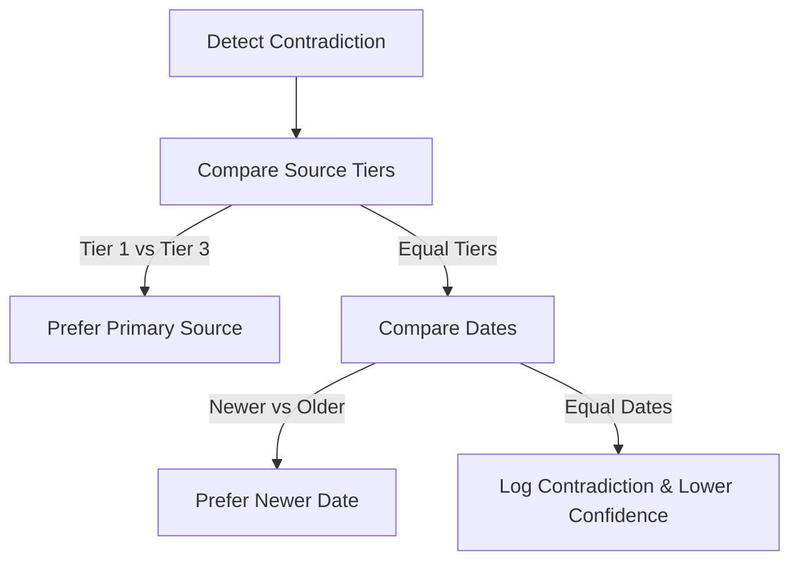

# Contradiction Resolution

Handles contradictory reports without silent merging or arbitrary deletion.

## Resolution Workflow

## Ground Rules
1. **Never Silently Merge**: Log both claims explicitly inside the report.
2. **Log Dates**: Flag older information as "stale" instead of deleting it.
3. **Trace Uncertainty**: Lower confidence of the related `Inference` to `low` or `unverified` if the contradiction is unresolved.
