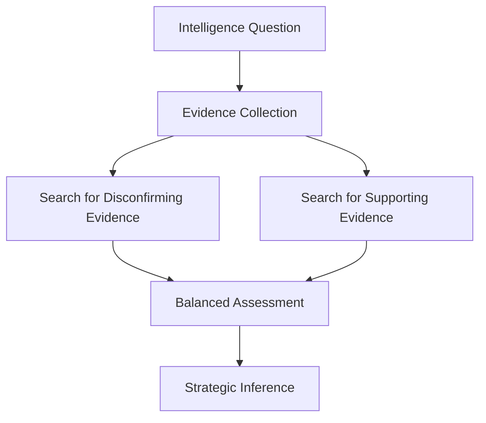

# Disconfirming Evidence Engine

Designed explicitly to prevent confirmation bias.

## De-biasing Loop

## Operational Rules
- For every high-impact inference, the agent **must** execute a search specifically for disconfirming signals.
- **Example**:
  - *Inference*: Competitor X is moving toward enterprise.
  - *Supporting Evidence*: Enterprise pricing tier, security features, sales hiring.
  - *Disconfirming Evidence*: SMB tier pricing remains heavily promoted on the homepage, developer self-service sign-ups are un-gated.
  - *Outcome*: Downgrade inference confidence to `medium` due to conflicting target segment signals.
